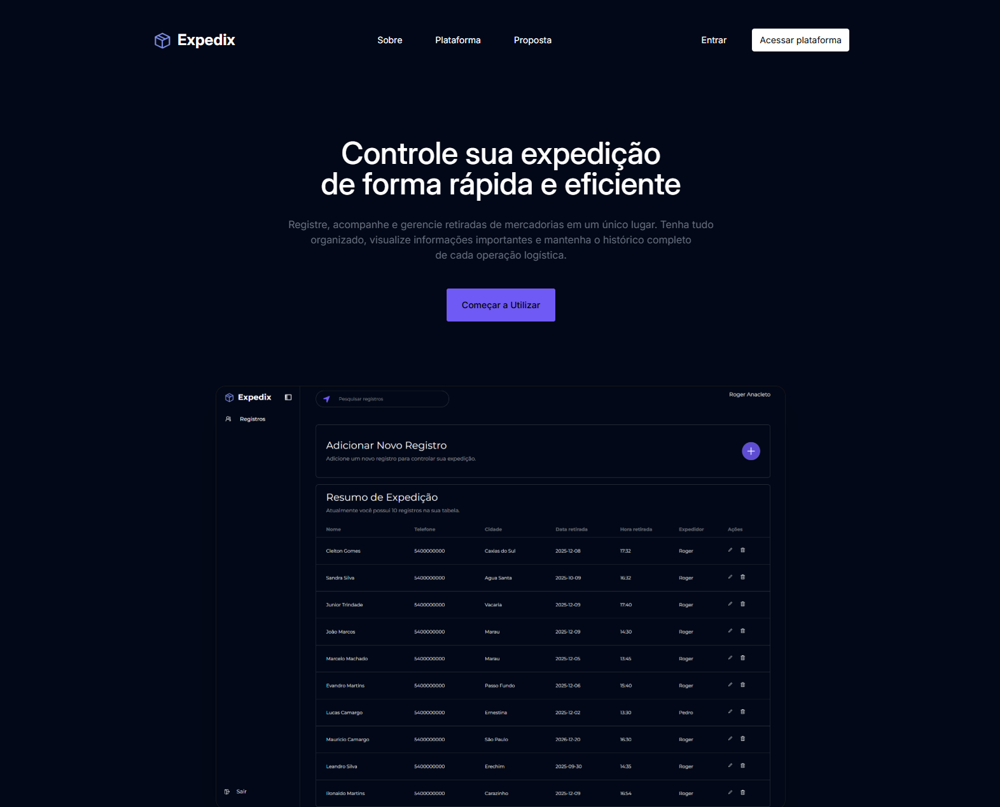
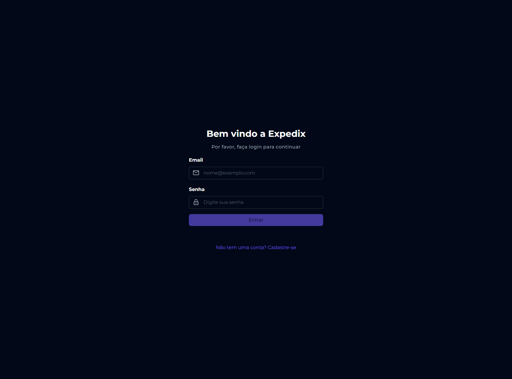
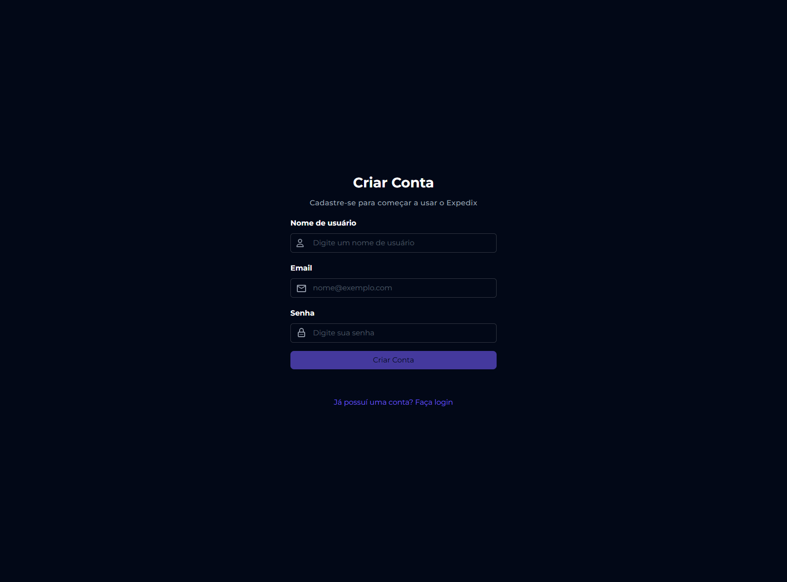
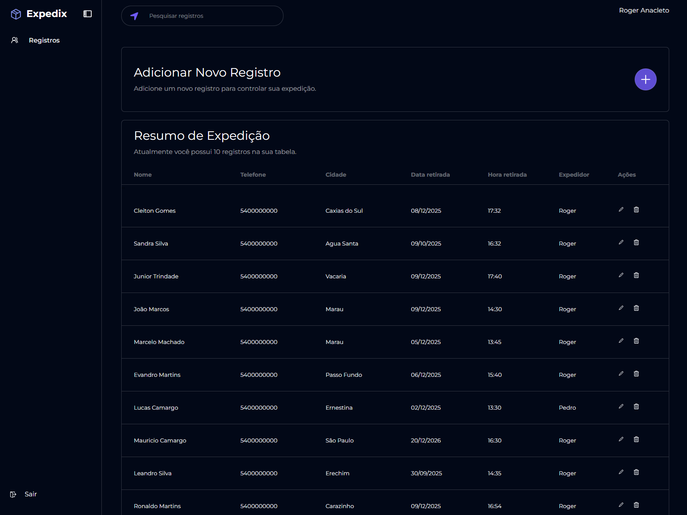
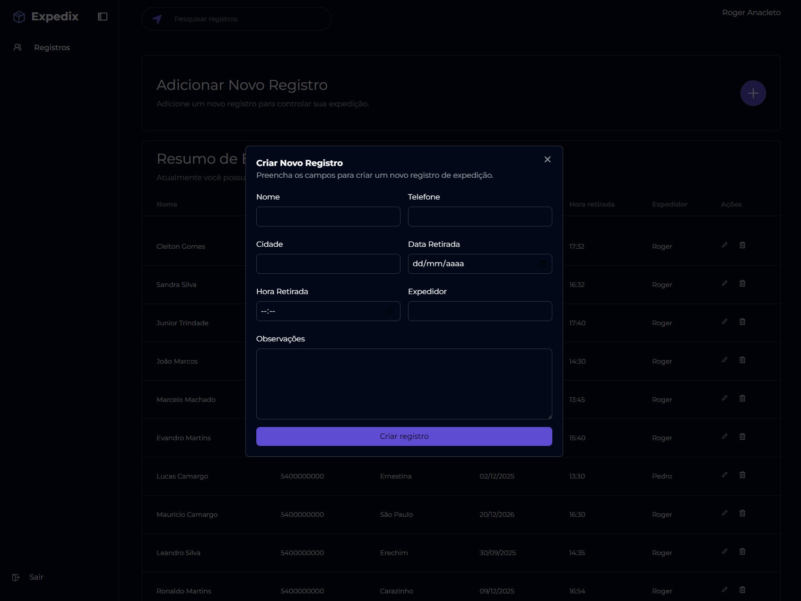

# 🛠️ Expedix – Controle de Expedição de Mercadorias


Sistema web para **gerenciamento e controle de expedição de mercadorias**, permitindo que empresas do setor de distribuição registrem, consultem e organizem retiradas de produtos de forma prática e eficiente.

---

## 🚀 Visão Geral

O **Expedix** foi desenvolvido para otimizar a logística de expedição de mercadorias, centralizando informações sobre retiradas, responsáveis, datas e status de cada operação.

A plataforma permite o **registro completo de retiradas**, visualização de **informações detalhadas**, **edição, consulta e exclusão** de registros, além de manter um **histórico completo** das expedições.  

O sistema conta com **autenticação de usuários**, **tabela organizada para visualização rápida**, **filtros de pesquisa** e uma **landing page institucional** apresentando o funcionamento da plataforma.

---

## 🖼️ Demonstração

### Login


### Cadastro (Signup)


### Tabela de Expedições


### Cadastro de Retirada


---

## 🧩 Funcionalidades

### 🔐 Autenticação
- Criação de conta (signup)
- Login seguro
- Logout disponível pelo menu

---

### 🏠 Tabela de Expedições
Após o login, o usuário tem acesso a uma **tabela completa de expedições**, permitindo visualizar rapidamente todos os registros cadastrados.

---

### ➕ Cadastro de Retiradas
- Registro via formulário
- Campos disponíveis:
  - Nome do responsável
  - Telefone
  - Cidade
  - Data e hora da retirada
  - Expedidor responsável
  - Observações

---

### 🗂️ Gerenciamento de Registros
- Listagem de todas as retiradas
- Ações disponíveis:
  - Editar registros
  - Excluir registros
  - Consultar informações detalhadas
  - Pesquisar por nome, cidade, data ou expedidor

---

### 🌐 Landing Page
- Página institucional apresentando o sistema
- Explicação do funcionamento da plataforma
- Botões de redirecionamento para **Login** e **Cadastro**

---

## 🛠️ Tecnologias Utilizadas

- **Frontend:** React.js
- **Linguagem:** TypeScript
- **Estilização:** Tailwind CSS
- **Backend / Serviços:** Firebase
  - Firebase Authentication
  - Firestore Database

---

## 📁 Estrutura do Projeto

```
prevsystem-app/
├── src/
│ ├── assets/ # Arquivos estáticos
│ ├── components/ # Componentes reutilizáveis
│ ├── contexts/ # Context API (autenticação e estados globais)
│ ├── layout/ # Layouts da aplicação
│ ├── pages/ # Páginas principais
│ │ ├── Admin
│ │ ├── Home
│ │ ├── Login
│ │ ├── Signup
│ │ └── NotFound
│ ├── services/ # Integrações com Firebase
│ ├── App.tsx
│ ├── main.tsx
│ └── index.css
├── .env
├── package.json
├── vite.config.ts
└── README.md

```
---

## ▶️ Como Executar o Projeto

### 📋 Pré-requisitos

- Node.js (versão 18 ou superior)
- NPM ou Yarn

---

### 🔧 Configuração do Ambiente

Este projeto utiliza o **Firebase**, portanto é necessário configurar as variáveis de ambiente.

Crie um arquivo **`.env`** na raiz do projeto e adicione:

```env
VITE_FIREBASE_API_KEY=
VITE_FIREBASE_AUTH_DOMAIN=
VITE_FIREBASE_PROJECT_ID=
VITE_FIREBASE_STORAGE_BUCKET=
VITE_FIREBASE_MESSAGING_SENDER_ID=
VITE_FIREBASE_APP_ID=
VITE_FIREBASE_MEASUREMENT_ID=
```
> ⚠️ As credenciais podem ser obtidas no console do Firebase ao criar um novo projeto.

---

### ▶️ Executando a aplicação

```bash
# Clone o repositório
git clone https://github.com/rogeranacleto/expedix.git

# Acesse a pasta do projeto
cd expedix-app

# Instale as dependências
npm install

# Inicie a aplicação
npm run dev
```

---

🎯 Objetivo do Projeto

O Expedix foi desenvolvido para oferecer uma solução prática e acessível para o controle de expedição de mercadorias, sendo ideal para micro e pequenas empresas do setor de distribuição.